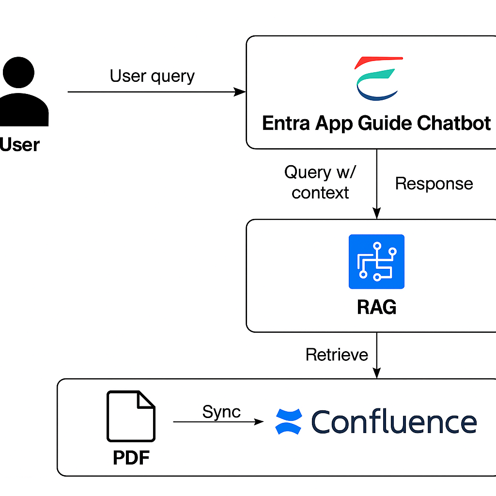

# 🛠 Entra App Copilot MVP

## 🎯 프로젝트 목표
- 사내 KAUTH 시스템과 Entra ID App 관리를 **Azure AI 기반으로 효율화**
- 승인 프로세스는 기존 KTAUTH 시스템에 유지 → 승인 완료 이벤트만 Azure 자동화와 연동
- 관리자의 업무 시간을 단축하고, 신청자의 편의성을 강화

---

## 🖼 아키텍처 다이어그램

---

## 🔗 Azure 서비스 매핑

| 기능 영역               | 활용 Azure 서비스                 | 설명 |
|-------------------------|-----------------------------------|------|
| **임직원 Q&A 챗봇**     | Azure OpenAI Service              | GPT-4o / GPT-35-turbo 기반 자연어 Q&A |
|                         | Azure AI Search                   | Confluence 가이드 문서 인덱싱 + 벡터 검색 |
| **Azure 구성도 분석**   | Azure AI Vision                   | 이미지 다이어그램에서 Azure 리소스 아이콘 자동 인식 (VM, App Service 등) |
|                         | Azure Document Intelligence       | PDF/PPT 구성도 내 텍스트·도형 추출 (OCR) |
|                         | Azure OpenAI + AI Search          | 추출 결과를 바탕으로 구성 설명·권한 추천 생성 |
| **Entra App 자동 등록** | Microsoft Graph API               | 승인 이벤트 연동 → Entra App 자동 생성 및 권한 매핑 |
| **알림/이벤트 처리**    | Azure Event Grid + Logic Apps     | 승인 완료 이벤트 트리거 → 이메일/MS Teams 알림 |
| **로깅/보안 관리**      | Azure Monitor + Log Analytics     | 신청/등록 활동 로깅, 감사 추적, 보안 정책 준수 확인 |

---

## 📍 단계별 로드맵

### 0단계 — PoC (3일)
- FAQ 챗봇 (Azure AI Search + OpenAI)  
- 답변에 Confluence 원문 URL 표시  
- 첨부 PDF/이미지 → Document Intelligence → OpenAI 요약 리포트 생성  

### 1단계 — 지식베이스·챗봇 고도화 (2~4주)
- Confluence 문서/이미지를 Azure AI Search 인덱싱  
- 검색 품질 최적화 (synonyms, boosting, k값 튜닝)  
- Streamlit/Kauth UI에 "관련 문서 더보기", "피드백 버튼" 추가  

### 2단계 — Azure 구성도 분석 서비스 (4~8주)
- Document Intelligence로 텍스트/도형 추출  
- Azure AI Vision으로 Azure 리소스 아이콘 식별  
- OpenAI + AI Search로 구성 설명 + 권한 추천 + 보안 경고 자동 생성  
- 신청서 UI에서 분석 리포트 탭 제공  

### 3단계 — Entra App 자동 등록 서비스 (승인 연동) (8~10주)
- 승인 완료 이벤트(Webhook) → Azure Function/Container App → Graph API 호출  
- Entra App 자동 생성, 권한 매핑, Redirect URI 등록  
- 실패 시 자동 롤백 및 알림  

### 4단계 — 운영/확장 (10~12주+)
- Power BI 대시보드: 신청량, 자동등록 성능, 보안 경고  
- 챗봇 피드백 기반 문서 자동 개선  
- 보안 고도화 (민감 권한 요청 시 추가 근거 요구)  
- 사내 레지스트리로 OIDC 모듈 배포, 샘플 앱 템플릿 제공  

---

## 📡 네트워크 시나리오

### 시나리오 A — 대외 통신 허용
- On-Prem → API Management (Private Endpoint) → Azure OpenAI / AI Search / Storage  

### 시나리오 B — 대외 통신 불가
- DMZ API Gateway 개방, 내부는 프록시 경유  
- 승인 이벤트만 Outbound 단일 경로 허용  
- ExpressRoute 또는 Site-to-Site VPN 활용 가능  

---

