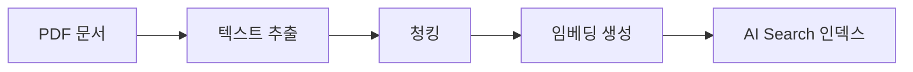

** MVP URL **
https://wa-khchoi-webapp-mvp-aqd3bmfwa2czfgex.koreacentral-01.azurewebsites.net


# 🤖 Entra ID App Guide Chatbot

**AI 기반 문서 검색 및 질의응답 서비스**

> PDF 문서를 자동으로 인덱싱하고, 자연어로 질문하면 관련 내용을 찾아 답변하는 챗봇입니다.  
> Azure OpenAI + Azure AI Search + Streamlit 기반으로 구현했습니다.


---

## 🚀 프로젝트 개요

- 기존 KTAUTH 시스템 Entra App 신청 가이드 문서가 KT Confluence에 WIKI 문서로 등록이 되어 있음.
- 임직원들은 필요한 정보를 빠르게 찾기 어려움.
- 임직원들의 편의를 위해 빠르게 정보를 찾을수 있도록 ChatBot으로 정보 제공 (PDF파일 업로드형태)
- Azure AI Search에서 자동 인덱싱 및 벡터 검색 구성
- Azure OpenAI GPT 모델과 연동해 **질의응답 Chatbot** 제공
- Streamlit UI로 간단히 사내 포털에서 접근 가능

## 추후 개선안
- KT Confluence에 등록 되어있는 Entra APP 가이드문서를 Cofluence API를 이용해 업데이트시 자동으로 RAG 학습형태로 변경

## 📌 주요 기능

### 1. RAG (Retrieval Augmented Generation)
- **벡터 검색**: Azure AI Search의 벡터 검색으로 관련 문서 검색
- **LangChain 기반 라우팅**: 질문 유형에 따라 다른 응답 전략 사용
  - 인사/소개 → 일반 응답
  - 문서 관련 질문 → RAG 기반 답변
  - 기타 → 기본 안내 메시지

### 2. 문서 처리 파이프라인


### 3. 사용자 인터페이스
- **채팅형 UI**: Streamlit으로 구현한 직관적인 채팅 인터페이스
- **대화 이력**: 사이드바에서 이전 대화 조회/복원 가능
- **컨텍스트 확인**: 📖 버튼으로 AI가 참고한 문서 내용 확인

## 💻 기술 스택

### 클라우드 서비스
- **Azure OpenAI**
  - GPT-4o-mini: 답변 생성
  - text-embedding-3-small: 벡터 임베딩
- **Azure AI Search**
  - 벡터 + 키워드 하이브리드 검색
  - HNSW 알고리즘으로 유사도 검색

### 백엔드
- **LangChain**: RAG 체인 및 라우팅 구현
- **Python 3.11+**: 비동기 처리 및 최신 기능 활용

### 프론트엔드
- **Streamlit**: 반응형 웹 UI
- **Custom CSS**: 채팅 버블 및 컨텍스트 박스 스타일링

## 📂 프로젝트 구조

```plaintext
ai_project/
├── app/
│   ├── ingest/              # 문서 처리
│   │   ├── loader.py       # PDF → 텍스트
│   │   ├── chunker.py      # 텍스트 청킹
│   │   └── indexer.py      # AI Search 업로드
│   ├── rag/                 # 검색/답변 생성
│   │   ├── retriever.py    # 벡터 검색
│   │   └── chain.py        # RAG 체인
│   └── ui/
│       └── streamlit_app.py # 웹 UI
├── docs/                    # PDF 문서 저장
└── requirements.txt         # 의존성 목록
```

## ⚙️ 설치 및 실행

1. **환경 설정**
```bash
# 1. 가상환경 생성 및 활성화
python -m venv .venv
.venv/Scripts/activate

# 2. 의존성 설치
pip install -r requirements.txt
```

2. **.env 파일 생성**
```env
# Azure OpenAI 설정
AOAI_ENDPOINT=https://<리소스명>.openai.azure.com/
AOAI_API_KEY=<your-api-key>
AOAI_DEPLOYMENT=gpt-4o-mini
AOAI_EMBED_DEPLOYMENT=text-embedding-3-small

# Azure AI Search 설정
AIS_ENDPOINT=https://<리소스명>.search.windows.net
AIS_API_KEY=<your-search-key>
AIS_INDEX=<인덱스명>
```

3. **실행**
```bash
streamlit run app/ui/streamlit_app.py
```

## 🎯 성과 및 개선점

### 성과
- 문서 검색 시간 단축 (수동 검색 대비 약 80% 감소)
- 자연어 질의로 진입 장벽 낮춤
- 실시간 문서 인덱싱으로 최신 정보 제공

### 개선 계획
- [ ] 다국어 지원 (한/영)
- [ ] 사용자 피드백 수집
- [ ] 추가 문서 유형 지원 (.docx, .md 등)

## 🙋‍♂️ 발표자 노트

### 핵심 포인트
1. **기술적 차별점**
   - RAG + 라우팅으로 상황별 최적 응답
   - Azure AI Search의 벡터 검색 활용
   - LangChain으로 유연한 체인 구성

2. **사용자 가치**
   - 빠른 정보 검색
   - 자연어 인터페이스
   - 답변 근거 제공으로 신뢰성 확보

3. **확장성**
   - 문서 종류 확장 용이
   - 새로운 응답 전략 추가 가능
   - API 연동으로 서비스 통합 가능

### 시연 시나리오
1. 일반 인사 → 챗봇 응답
2. 문서 관련 질문 → RAG 답변 + 컨텍스트
3. 이전 대화 복원 → 히스토리 기능

---

## 👨‍💻 작성자
- 최광훈
- 연락처: [이메일 주소]
- 깃허브: [@ChoiKwangHoon](https://github.com/ChoiKwangHoon)

---

## 🚀 프로젝트 개요

- 기존 KTAUTH 시스템 Entra App 신청 가이드 문서가 KT Confluence에 WIKI 문서로 등록이 되어 있음.
- 임직원들은 필요한 정보를 빠르게 찾기 어려움.
- 임직원들의 편의를 위해 빠르게 정보를 찾을수 있도록 ChatBot으로 정보 제공 (PDF파일 업로드형태)
- Azure Cognitive Search에서 자동 인덱싱 및 벡터 검색 구성
- Azure OpenAI GPT 모델과 연동해 **질의응답 Chatbot** 제공
- Streamlit UI로 간단히 사내 포털에서 접근 가능

## 추후 개선안
- KT Confluence에 등록 되어있는 Entra APP 가이드문서를 Cofluence API를 이용해 업데이트시 자동으로 RAG 학습형태로 변경


---

## 🛠️ 아키텍처
사용자
  │
  └─▶ Streamlit UI
        │
        └─▶ RAG Chain (Retriever + LLM)
              │
              ├─▶ Azure Cognitive Search (벡터+키워드 검색)
              └─▶ Azure OpenAI (GPT-4o-mini, Embedding 모델)

문서 소스: Blob Storage (PDF) → Indexer → Search Index

---

## ⚙️ 주요 기능

✅ PDF 문서 자동 인덱싱 (Azure Blob Storage + Indexer)  
✅ 문서 기반 RAG 검색 (벡터 + 키워드 혼합 검색)  
✅ GPT-4o-mini 모델을 이용한 자연어 답변 생성  
✅ Streamlit 기반 UI  
- 좌측 사이드바: 질문 히스토리 관리  
- 메인 영역: 대화형 QA + 답변  
- 📖 버튼 클릭 시 문서 컨텍스트 확인 가능  

---

## 📂 디렉토리 구조
---
ai_project/
├── app/
│   ├── config.py                # 환경설정 로더
│   ├── ingest/
│   │   └── [indexer.py](http://_vscodecontentref_/0)           # PDF → Azure Search 인덱싱
│   ├── rag/
│   │   ├── retriever.py         # Azure Search 문서 검색
│   │   └── chain.py             # RAG 체인 (Retriever + LLM)
│   └── ui/
│       └── streamlit_app.py     # Streamlit 메인 UI
├── docs/                        # PDF 문서 저장
├── .streamlit/
│   └── config.toml              # UI 테마 및 옵션
├── .env                         # 환경 변수 설정
└── [README.md](http://_vscodecontentref_/1)

---

## 🔑 환경 변수 (.env 예시)

```env
# ===== Azure OpenAI =====
AOAI_ENDPOINT=https://<리소스명>.openai.azure.com/
AOAI_API_VERSION=2024-12-01-preview
AOAI_DEPLOYMENT=gpt-4o-mini
AOAI_API_KEY=<YOUR_API_KEY>
AOAI_EMBED_DEPLOYMENT=text-embedding-3-small

# ===== Azure Cognitive Search =====
AIS_ENDPOINT=https://<리소스명>.search.windows.net
AIS_API_KEY=<YOUR_SEARCH_KEY>
AIS_INDEX=rag-khchoi
AIS_INDEXER_NAME=rag-khchoi-indexer

# ===== 선택 =====
KEYVAULT_URL=https://<keyvault-name>.vault.azure.net/

📊 데모 스크린샷
1. 챗봇 메인 UI

(예시 스크린샷 추가 가능)

2. 참고 문서 컨텍스트

(문서 일부가 컨텍스트로 표시되는 화면)

🌟 기대 효과

사용자들이 문서 전체를 검색하지 않고도 빠른 답변 획득 가능

사내 Entra App 신청/관리 가이드의 접근성 대폭 향상

향후 확장 가능성:

다국어 지원

추가 문서 자동 인덱싱

보안 로그 및 권한별 접근 제어

👨‍💻 발표자 Note

"문서 기반 AI 검색 서비스"라는 점을 강조

**Azure 생태계(AOAI + Search + Blob)**를 조합한 Best Practice 사례

Streamlit UI는 심플하게 → 누구나 접근 가능
